#TROSKIE 
<h1>TROSKIE APP</h1>
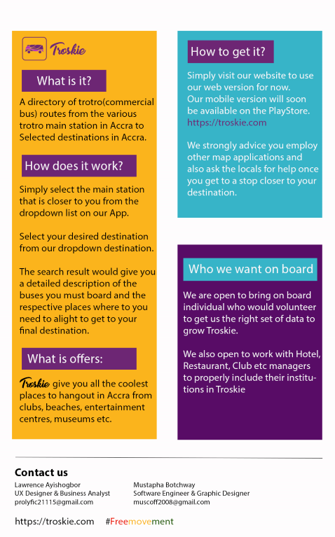

This app is a commercial bus app designed specifically for commercial buses in Ghana.

It aims to help foreigners navigate their way to some interesting places in the city using the commercial buses in Ghana instead of using Uber or Taxi.

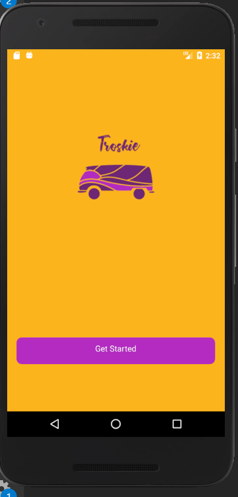
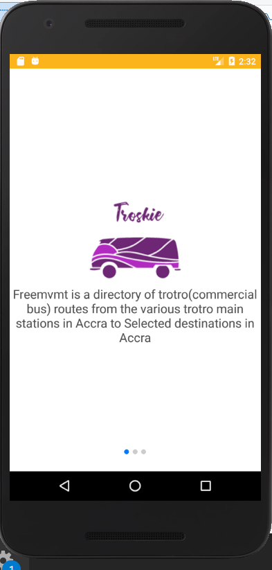
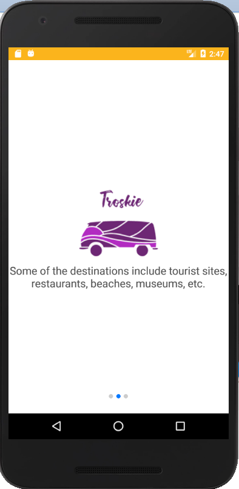
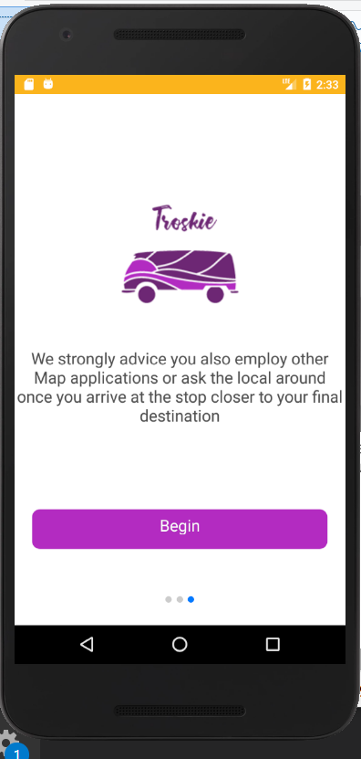

<h1>Main Interface</h1>
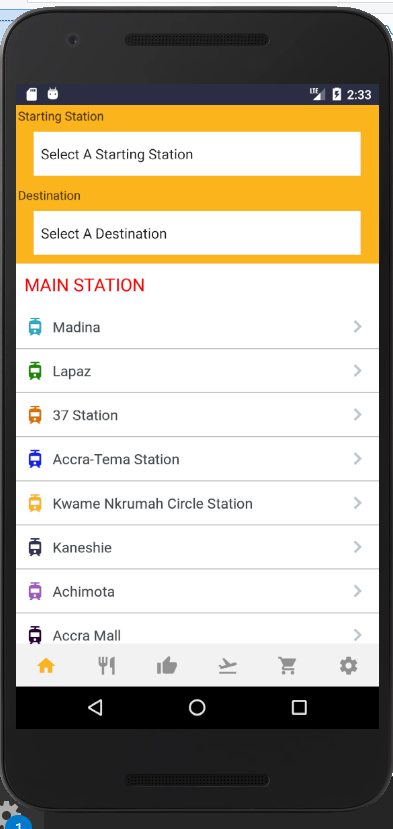

If you are a foreigner or a local and you want to visit some interesting places in Ghana specifically Accra(Since the data we have currently is only subjected to Accra Region)

<ul>
	<li>Firstly, Enter or select from our dropdown list of Main station</li>
	<li>NEXT: Select a destination from our dropdown destination</li>
	<li>Our app automatically queries our database and present you with the various buses you are to board and the exact places you are to alight at.</li>
</ul>
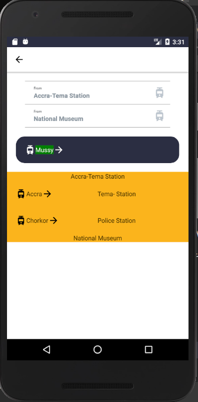

<h1>Restaurant</h1>

The restaurant interface list of the cool restaurants we have in our database

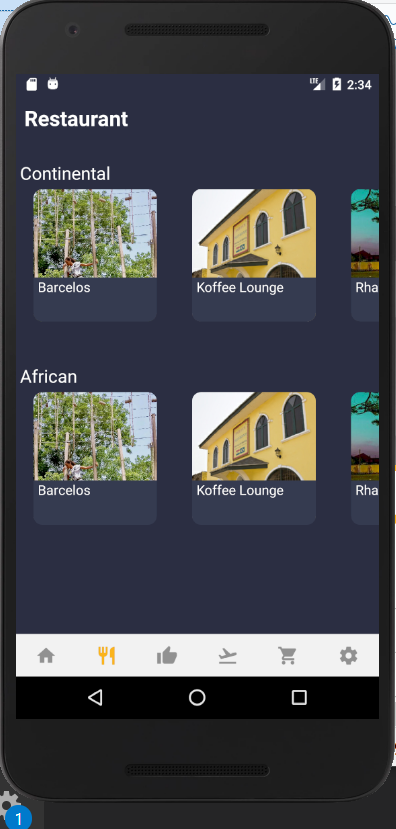

Upon a click on any of the restaurant's name, the user gets more details on the details and their contact address

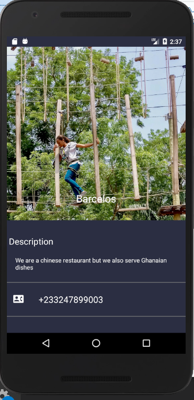
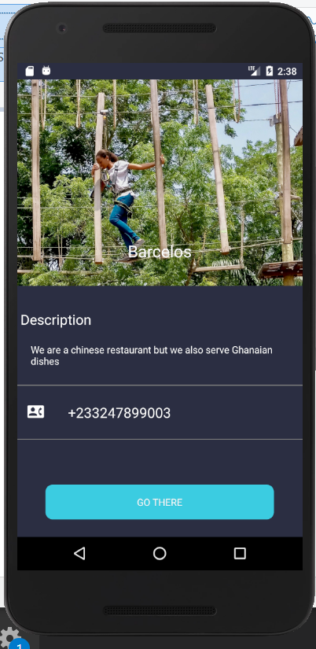

When the user clicks on the "Go There" button, it takes the user to a new interface with the destination already set

The user then is required to select the main station that they are

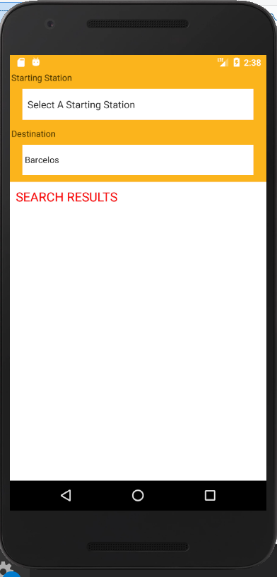

When a user finally set the main statio that they are, a query is make to the server and the response is fetched and displayed to the user

<h1>Accra Highlights</h1>
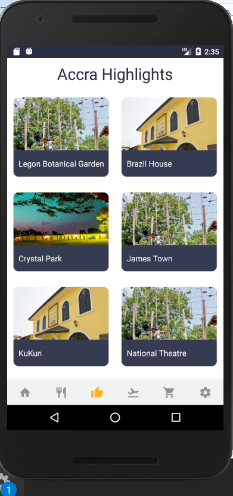
<h1>Arts And Culture</h1>
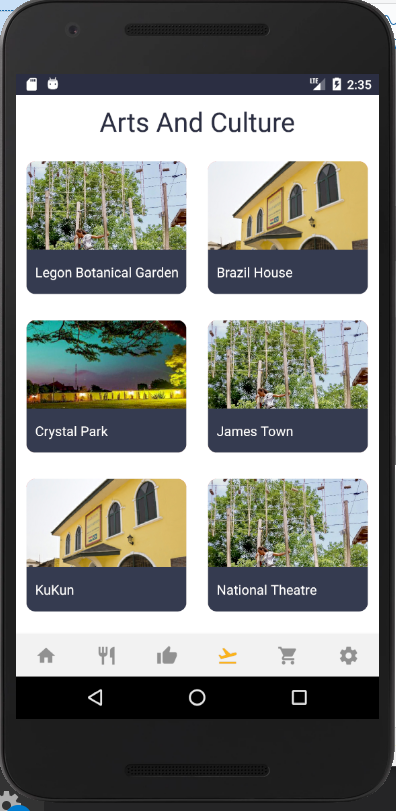
<h1>Shopping</h1>
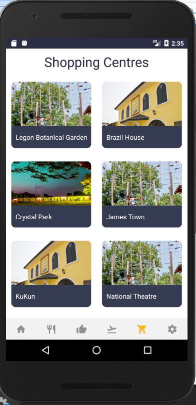
<h1>Categories</h1>
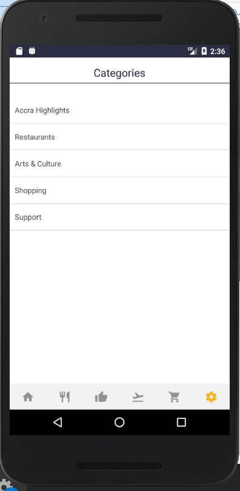
<h1>Support</h1>
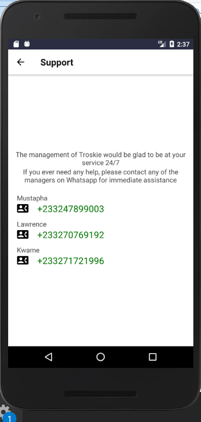

Please bare in mind that the App is not complete but it is more than 60% done. 

The databases has been set
The queries have been written

All that is left now is a data collection and few modification to the app and it should be ready for the market.

Please hit me up in my email muscoff2008@gmail.com if you have any questions on how i intend to complete it

Thank you